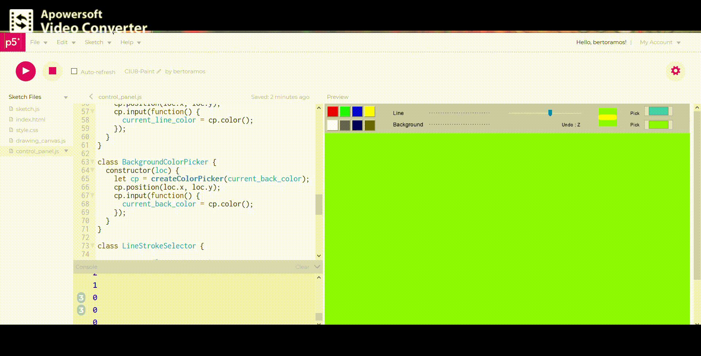

# Paint8

###### Alberto Ramos Sánchez

> Probar en <https://editor.p5js.org/bertoramos/full/yrYN2y1OH>

El objetivo de esta práctica es desarrollar un programa de dibujo utilizando [*P5JS*](https://p5js.org).

### Funcionalidades

En esta aplicación se permite al usuario realizar dibujos sobre un lienzo arrastrando el ratón sobre él. También puede elegir el grueso de la línea con un *slider*, y el color de fondo y el de la línea mediate dos métodos: utilizando colores por defecto, en los botones; y con el selector de colores.

### Implementación

#### Dibujo

Todas las líneas dibujadas se almacenan como un conjunto de puntos agrupadas por la clase *Shape*. Cada vez que el usuario arrasta el ratón, se crea un *Shape* y se van almacenando los puntos hasta que el usuario levanta el ratón.

Todos los *Shape* se almacenan en la clase *ShapeSet*. La clase *DrawingCanvas*, se encarga de crear un nuevo *canvas* (*createGraphics*), donde se dibujan todas las formas almacenadas en *ShapeSet*, con el color asociado en el momento que se dibujaron y sobre el color de fondo actual.

#### Selector de colores por defecto.

El selector de colores por defecto es implementado en las clases *DefaultBackgroundColorSelector* y *DefaultLineColorSelector*.

Ambas siguen el mismo comportamiento. Se crean tantos botones como colores queramos, organizados en forma matricial según la variable *matrix_shape*. En nuestro caso tenemos 4 colores para cada uno (color de línea y de fondo) organizados en una matriz de 1x4.

A cada botón se le asocia una función, que permite actualizar el color actual para la línea (*current_line_color*) o el fondo (*current_back_color*).

#### Selector de colores.

El selector de colores es creado utilizando el elemento de *DOM* *ColorPicker* (*createColorPicker*). A cada uno de ellos se les asocia una función que permite actualizar los colores actuales para la línea (*current_line_color*) o el fondo (*current_back_color*).

#### Selector de grosor

El selector de grosor se crea utilizando el elemento del *DOM* *Slider* (*createSlider*). A este se le asocia una función que permite actualizar el grosor de línea actual (*current_line_stroke_weight*).
